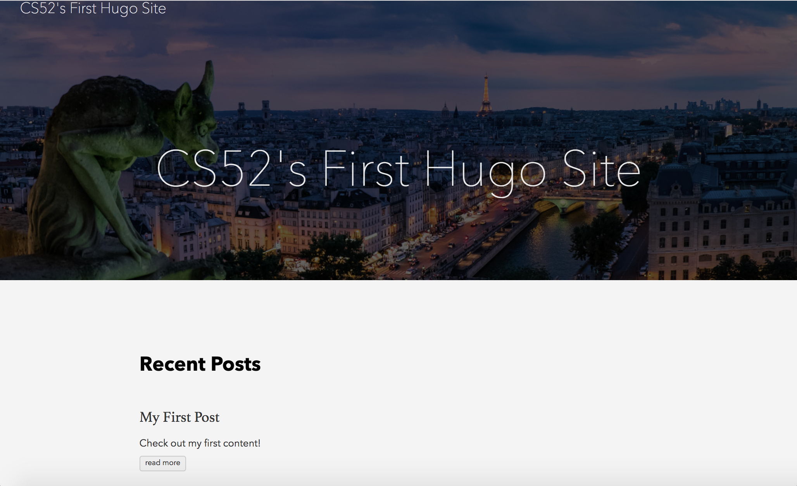
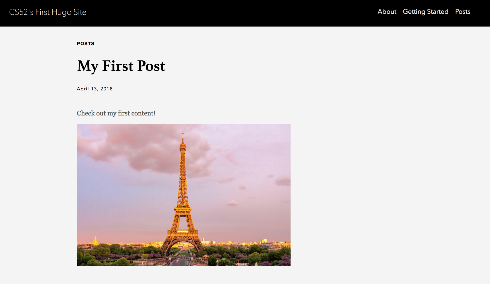
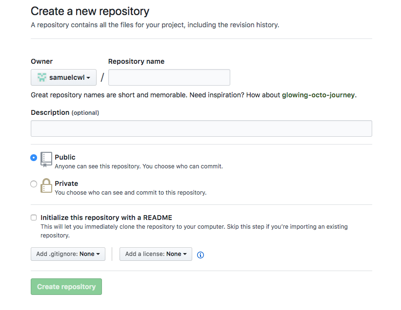

# Getting Started with Hugo
Today we're going to use Hugo to generate our first static site! Open up your Terminal and follow along with these instructions [based on [Hugo's Getting Started guide](https://gohugo.io/getting-started/quick-start/)]. Feel free to use their website for further documentation.
## Install Hugo
Then verify the new install.
```
brew install hugo
hugo version
```
## Create a new site
This will automatically create a new directory for your site called `quickstart`.
```
hugo new site quickstart
```

You can ignore the suggestions that come up, we're going to get to all of that in the tutorial.

## Add a theme
See [themes.gohugo.io](https://themes.gohugo.io) for a list of themes to consider. We happened to like the Ananke theme that the quickstart guide uses, but feel free to browse for another.
```
cd quickstart;
git init;
git submodule add https://github.com/budparr/gohugo-theme-ananke.git themes/ananke;

# Edit your config.toml configuration file
# and add the Ananke theme.
echo 'theme = "ananke"' >> config.toml
```

## Configure the theme
Open up `config.toml` in Atom and change the title to whatever you want.

```
atom config.toml
```

```
languageCode = "en-us"
title = "CS52's First Hugo Site"
theme = "ananke"
```


## Adding Content
In Hugo, everything is a page. Typically, you'll have a `content` folder where pages are further organized under directories. In our current project, we should automatically have a `content/posts/` directory.
After your site is configured, we can add our first post.

### Our first post
*Note:* Make sure you're in your top-level directory (where your config file is located) or else Hugo will complain at you.

```
hugo new posts/my-first-post.md
```
Take a look at the tree organization of the `content` directory:

```
tree content
```
(You might have to `brew install tree`)

```
content
└── posts
    └── my-first-post.md
```


If you open up this newly created file, you'll see that Hugo has already pre-configured some of the settings for the page. It'll look something like this:

```
---
title: "My First Post"
date: 2018-04-13T12:01:29-04:00
draft: true
---

```

Notice that we've specified `draft: true`. This allows us to create and work on drafts before publishing them, which is very helpful for a live blog. Feel free to add some Markdown content below the header.

Now we can test out the site with the drafts toggle on:

```
hugo server -D
```



Notice how Hugo automatically styles your post for you! Where did this come from? If you take a look inside the `themes/ananke` directory, you'll see our theme comes with built-in html layouts under the `post` directory, as well as a `_default` directory and a `partials` directory which contain more instructions to automatically style all new content we create.

### Adding images

What if we want to add images to our Markdown files? Hugo provides a few ways to do this. First, store your images in the `static/` directory. This is where Hugo automatically looks for static content. It's also common practice to add an additional `static/img/` directory specifically for images, but that's up to you.

Add some images to `static`:

```
├── static
│   ├── post-1.jpg
│   └── post-2.jpg
```

Then you can simply include them in any of your Markdown files. For example, in `my-first-post.md`:

*Note:* You **don't** need to add `../` or `../static/` to the path name of the image. That's the magic of the `static` folder! Check out [this tutorial](https://tutorialedge.net/golang/hugo/hugo-adding-images-to-posts/) for more help and other cool ways you can add images into your Hugo site using tricks called 'shortcodes'.

```
---
title: "My First Post"
date: 2018-04-13T12:01:29-04:00
draft: true
---


```
Great!

Let's `hugo server -D` again. Now if you click `Read More` under your first post on the main page, you'll be directed to the post's page hosted at `http://localhost:1313/posts/my-first-post`:




### Adding a nav bar
Adding additional layouts such as a top nav bar with links to pages within your site is incredibly easy.

First, we need to create pages for some of the links we want to include in our navbar.

```
hugo new content/about.md
hugo new content/getting-started.md
```

Add some Markdown content in each of these pages.

Now we need to create a menu. In the `config.toml` file, add the following code to create the navbar menu:

```
[menu]

  [[menu.main]]
    identifier = "about"
    name = "About"
    pre = "<i class='fa fa-heart'></i>"
    url = "/about/"
    weight = -110

  [[menu.main]]
    name = "Getting Started"
    pre = "<i class='fa fa-road'></i>"
    url = "/getting-started/"
    weight = -100

  [[menu.main]]
    name = "Posts"
    pre = "<i class='fa fa-road'></i>"
    url = "/posts/"
    weight = -100
```

Congratulations! This is what your final product should look like:


*Now, before you go on......*


## Creating a New Theme

Now you have seen what can be done with an existing theme. But what if you want
to create your own? Let's see what it would take to start designing a new theme.

### Create the New theme

Hugo makes it simple to begin making a new theme.
Think of your own creative name instead of 'theme-name'.

`hugo new theme theme-name`

This will create some of the files and folders needed for the new theme. Next,
go back into your `config.toml` file and change the `theme` field to your theme's name.
Now let's open up the `themes/theme-name/layouts/index.html` file and place
some basic html there:

```
<!DOCTYPE html>
<html>
<body>
  <p>Hello World!</p>
</body>
</html>
```

Save the file, and with the server still running you should see 'Hello World!' on your site's page.
You may need to restart your hugo server to apply the change.


### Create a New Archetype for Posts

Archetypes are essentially a base layout for a new file. Here we are making an archetype so that whenever we create a new post, it comes seeded with the frontmatter (metadata fields) that we desire. In the `/archetypes` directory (not the archetypes directory in your theme folder), create a new file called `posts.md` and delete the `default.md` file.
Add the following to `posts.md`:

```
---
title: "{{ replace .Name "-" " " | title }}"
date: {{ .Date }}
draft: true
type: "post"
---
```

This is now the frontmatter that will populate a post when you create a new one.
Let's try it out. Use `hugo new posts/post-name.md` to create a couple more posts and add some content.
You should see that the new archetype is in use.

**In each post you had previously, you will need to add the `type: "post"` field to the frontmatter.**
This field is in our new archetype, but was not in the default archetype when those posts were created.


Now we can get to building out our theme a bit.

### Building the Front Page View

Go back to the `index.html` file and lets replace the body with this:

```
  <h1>Pages</h1>
  {{ range .Data.Pages }}
    {{ if eq .Type "page" }}
      <h2><a href="{{ .Permalink }}">{{ .Title }}</a></h2>
    {{ end }}
  {{ end }}
  ```

  This will show titles for all the pages we have which will be the "About"
  and "Getting Started" pages we have already. These titles should pop up on the site.
  But how do we get our posts to show up?

  ```
  <h1>Posts</h1>
  {{ range first 10 .Data.Pages }}
    {{ if eq .Type "post"}}
      <h2><a href="{{ .Permalink }}">{{ .Title }}</a></h2>
    {{ end }}
  {{ end }}
  ```

  Adding this after the above "Pages" code will let us see the first ten posts.
  Notice that we require the type of the file to be "post" as we defined in our archetype.
  Also, the above code included links to each post and page so we can navigate to them. Try this out.
  
  If you cannot navigate to your "About" and "Getting Started" pages, add `type: "page"` to each of those
  page's frontmatter and the links should now work. This is because we have a conditional in the code above
  looking for files of type "page".

  ### Templates

  The most important aspect of a Hugo theme is the template. There are three types of templates:
  single (for content pages), list (for list pages), and partial (for construcitng others).
  Let's create our single template. Open up `themes/theme-name/layouts/_default/single.html`
  and add the following:

  ```
<!DOCTYPE html>
<html>
<head>
  <title>{{ .Title }}</title>
</head>
<body>
  <h1>{{ .Title }}</h1>
  <h2>{{ .Date.Format "Sun, Feb 11, 2018" }}</h2>
  {{ .Content }}
</body>
</html>
```

This will set the content that shows up on any "single" page, as in a post. It includes a
format for the date so Hugo knows how to show the date. You should now see
that posts show up as described here if you click on their link.

Next, let's create a template for the "list" pages, like our homepage. navigate
to `themes/theme-name/layouts/_default/list.html` and insert this:

```
<!DOCTYPE html>
<html>
<body>
  {{ range .Data.Pages }}
    <h1><a href={{ .Permalink }}>{{ .Title }}</a></h1>
  {{ end }}
</body>
</html>
```

Your homepage layout will now be governed by the html outlined in this file.
Play around with it if you wish.

### Partials

As mentioned above, partial templates can be used in building other templates or files, 
almost like a constant that stores a code block.
Open up `themes/theme-name/layouts/partials/header.html` and let's make a partial
to store the header for our html documents.

```
<!DOCTYPE html>
<html>
<head>
    <title>{{ .Title }}</title>
</head>
<body>
```

And let's do the same for `footer.html`.

```
</body>
</html>
```

Now to put them to use. Open up the `themes/theme-name/layouts/index.html` file
and lets replace the existing header and footer with partials. Replace the existing
code with this:

```
{{ partial "header.html" . }}

  <h1>Pages</h1>
  {{ range .Data.Pages }}
    {{ if eq .Type "page" }}
      <h2><a href="{{ .Permalink }}">{{ .Title }}</a></h2>
    {{ end }}
  {{ end }}

  <h1>Posts</h1>
  {{ range first 10 .Data.Pages }}
    {{ if eq .Type "post"}}
      <h2><a href="{{ .Permalink }}">{{ .Title }}</a></h2>
    {{ end }}
  {{ end }}

{{ partial "footer.html" . }}
```

We can see that the calls to `header.html` and `footer.html` will be replaced with the code in their respective files.
Reload the page and you should see that nothing has changed, but the partials are now in use.


### Styling

Lastly, let's try to add just a bit of styling. Create a `themes/theme-name/static/css/main.css` file.
Let's add in a bit of simple css.

```
body {
  color: #00aaff;
  background-color: yellow;
  margin-left: 10%;
}
```

You'll notice these changes have not been applied yet. We need to link the css
files to our html. To do this, head to the `header.html` file and add the links.

```
<link rel="preload" href="css/main.css" as="style" onload="this.rel='stylesheet'">
```

You should now see your styling changes have been applied to the main page.
Add a few quick styling changes to make your page unique.

This is obviously an extremely simple theme, but hopefully it shows how a theme
can be made quickly and applied to the pages of your site. 

### Reverting to Ananke

By now I'm sure you're eyes are hurting from that horrible yellow background.
Let's change our site back to using the 'ananke' theme. Change the `theme` field in
`config.toml` back to Ananke and save. You may need to restart your hugo server to apply the change.


## Hosting and Deployment


### Manual Deployment And First Run

Now that you have a beautiful site setup, let's prepare to deploy it! :rocket: :rocket:

**Before you do anything below, go to your `posts`, `about.md` and `getting-started.md` files, and turn the `drafts` flags in each Markdown file to `false`**.


1. Install Surge CLI (if you **haven't already done so** for your past short assignments and labs)

    `npm install -g surge`

2. Navigate to your project root directory.

3. Now, build your site as follows:

    `hugo`

  This will build and package all of your website's content into a folder called `public`. This is the folder which you want to deploy to your webhost.

  **Note**: In the future, before you run `hugo` again to build your site, you should always delete your existing `/public` folder first. Running `hugo` will not delete the public folder for you and may result in content conflicts.

4. Navigate to the `public` folder generated by `hugo`.

    :exclamation: Make sure you are in the `public` folder before running the command :exclamation:

    Now, run the following command:

      `surge`

5. If this is your first time using Surge, you should sign up at this point.

6. If not, make sure it is in the `public` folder and then feel free to **accept** the given domain or change your URL by modifying the Surge domain as follows: **<-YOUR PREFERRED DOMAIN->.surge.sh**

7. Once you have deployed the website, you can go to the URL to see your beautiful webpage now live!

    **Note**: If you have problems viewing the styling on your Surge url, you may have to make sure that your theme is set properly.

### Automating Deployment with Git Hooks (OPTIONAL - but will make your life *so* much easier)

Now, we want to automate this process with **Git Hooks**. Before we go into this process, however, we have to create a remote repo to push our local repo to.

1. Go to [github](https://github.com/).
2. Log in to your account.
3. Click the [new repository button](https://github.com/new) in the top-right.

  

4. Click the “Create repository” button.
5. Follow the second set of instructions:

```
$ git remote add origin https://github.com/YOUR_USER/NEW_REPO`
$ git push -u origin master
```
6. Create `.gitignore` file with the following:

```
node_modules
public
```
7. `Commit` and `push` again to your repo to make sure everything is working.

    

**Now, we can start automating the process with Git Hooks.**

1. Create a `package.json` in your project root folder and follow through the defaults:

    `npm init`

2. Then, save both submodules as development dependencies by running:

    `npm install --save-dev surge git-scripts`

3. Now, both `git-scripts` and `surge` should be listed as follows:

    ```
    "devDependencies": {
      "surge": "^0.2.1"",
      "git-scripts": "^0.2.1"
    }
    ```

4. Now, create a new Bash script in your CLI at your project root folder:

    `atom deploy.sh`

5. Copy the following into the script:

    ```
    #!/bin/bash
    rm -rf public
    hugo
    surge --domain <YOUR DOMAIN>.surge.sh ./public
    ```

6. Grant it elevated status as follows:

    `sudo chmod 755 ./deploy.sh`

7. The Git Scripts package you’ve installed now allows you to add Git Hooks right into your `package.json` file. After the `devDependencies` section, add the following:

    ```
    "devDependencies": {
      "surge": "latest",
      "git-scripts": "0.2.1"
    },
    "git": {
      "scripts": {
        "pre-push": "./deploy.sh"
      }
    }
    ```

8. Now, when you push to your repository…

    `git push origin master`

    …the pre-push Git Hook will delete the existing `public` folder, call `hugo` and run `surge` which publishes the public directory to your domain.

    You now no longer have to worry about deleting `public` folder each time before you run hugo. You just have to commit and push your code to publish a new post onto your static site.


# Sass Tutorial (Activity at Bottom is Extra Credit)

### Installation Tutorial

Mac Installation (For other operating systems, please check `http://sass-lang.com/install` for instructions)

To install sass, run the command: `npm install -g sass` in 💻terminal.

To check that Sass is installed, check the version with the command: `sass -v`.

### Variables

With Sass variables, we can store information that we want to use multiple times. For example, if a brand color/font is used multiple times throughout your website, you may want to store those in variables and just call the variable each time.

We can assign colors and fonts to variables with the following we can do:


	$primary-font: Times New Roman, serif
	$primary-color: #a4a4a4
	$secondary-color: #faf7f4

And when we reference the variable as our value:

	div
		color: $primary-color
		background-color: $secondary-color
		font: $primary-font

Notes:

	Compared to CSS, Sass does not require brackets {} or semicolons ;

	Sass is a preprocessor so when processed, the variables that we define are translated into normal CSS.

### Nesting

With Sass, we can nest our CSS selectors similar to the hierarchy of HTML.

(without Sass) Rather than writing:

	footer ul {
		display: flex;
		flex-direction: row;
		justify-content: space-around;
		list-style: none;
	}

	footer li {
		display: inline-block;
	}

	footer p {
		font: $primary-font;
		color: $primary-color;
	}

(with Sass) We can write:

	footer {
	  ul {
	    display: flex;
		flex-direction: row;
		justify-content: space-around;
		list-style: none;
	  }

	  li {
	  	display: inline-block;
	  }

	  p {
	   font: $font-stack;
	   color: $primary-color;
	  }
	}

With Sass, we establish the same visual hierarchy as HTML. The ul, li and p selectors now live under the footer selector, similar to how each tag would be structured in HTML.

### Mixins

Mixins are similar to variable but allow you store larger chunks of CSS declarations that you may want to reuse throughout a website.

To declare a mixin, we first use the `@mixin` tag, followed by the name of the mixin and the inputs we want to use.

The mixin declaration would look like

	@mixin $mixinName ($input1, $input2){
		...
	}

For example:

	$primary-color: blue;

	@mixin navItem ($color, $backgroundColor) {
		color: $color;
		background-color: $backgroundColor;
    }

	.rectangle { @include navItem ($primary-color, black); }

When the CSS is generated, it will compile to become:

	.rectangle{
		color: blue;
		background-color: black;
	}

Notes:

Default Values can also be set so for the example above:

	@mixin navItem($color, $backgroundColor: green) {
		color: $color;
		background-color: $backgroundColor;
	}

	.rectangle { @include navItem (blue); }

which would give us:

	.rectangle{
		color: blue;
		background-color: green;
	}

The color is set to blue with the first argument that is passed in and the background-color is set to green by default since there is no correspnding argument passed in.

### Inheritance

	.smallShyDog{
		background-color: white;
		margin: 100000px;
		height: 1px;
		width: 1px;
		border: 1px solid black;
	}

	.smallShyCat{
		background-color: orange;
		margin: 100000px;
		height: 1px;
		width: 1px;
		border: 1px solid black;
	}

	.smallShyHippo{
		background-color: grey;
		margin: 100000px;
		height: 1px;
		width: 1px;
		border: 1px solid black;
	}

We can employ Sass inheritance by using `@extend` to shorten our code where the selectors inherit the same properties and values from the same parent.

	.smallShyAnimals{
		margin: 100000px;
		height: 1px;
		width: 1px;
		border: 1px solid black;
	}

	.smallShyDog{
		background-color: white;
		@extend .smallShyAnimals;
	}

	.smallShyCat{
		background-color: orange;
		@extend .smallShyAnimals;
	}

	.smallShyHippo{
		background-color: grey;
		@extend .smallShyAnimals;
	}

Each of the small shy animals inherit their small dimensions (because they are small) and large margins (because they are shy) from a parent selector .smallShyAnimals. The background-color for each of the animal selectors are different but that is okay since they are siblings and can branch out beyond their shared attributes.


### Additional Features

Sass allows us to break down our CSS into smaller parts, which is more maintainable and easier to organize.

For example, if we want to break down our styles for each page of our website, we can!

Say we have multiple Sass files: _homePage.scss, _userPage.scss, and _loginPage.scss. We can import all these pages into a singular page called styles.sass.

	// a small section: _homePage.scss

	.homePageButton{
		width: 20px;
		height: 20px;
		border-radius: 5px;
		background-color:blue;
	}

	// a small section: _userPage.scss

	.userPageButton{
		width: 100px;
		height: 100px;
		border-radius: 10px;
		background-color:green;
	}

	// a small section: _loginPage.scss

	.loginPageButton{
		width: 100px;
		height: 50px;
		border-radius: 3px;
		background-color:yellow;
	}

All these files can be imported into the base file:

	// _styles.sass

	@import homePage
	@import userPage
	@import loginPage

	body
	  font: Times New Roman, serif
	  background-color: #faf7f4

Additionally, Sass supports standard math operators (+, -, *, /, and %):

	.rectangle
	  width: 250px / 80px * 80%

### Sass vs Scss

Sass is the older syntax where brackets and semicolons are not used. The new and primary syntax of Sass 3 is called Scss. Scss is more like the traditional CSS with brackets and semicolons while still supporting the features of Sass such as nesting.

## Extra Credit Activity

Write the declaration for a mixin called sassyHugo for a color, font-size and border-radius with a default of 5px. Show how the mixin is called by a div and what the div would look like after Sass has compiled to CSS. Please note that you have completed the extra credit on canvas.

### Additional Sass Resources:

	http://sass-lang.com/install
	http://sass-lang.com/guide
	https://cssauthor.com/sass-resources/
	http://thesassway.com/
	https://www.sitepoint.com/html-css/css/sass-css/
	http://sassbreak.com/
	https://scotch.io/tutorials/getting-started-with-sass
	https://www.sitepoint.com/the-benefits-of-inheritance-via-extend-in-sass/
	http://sass.news/
	http://zerosixthree.se/8-sass-mixins-you-must-have-in-your-toolbox/

# To Submit on Canvas

  :ballot_box_with_check: Your Surge URL to your Hugo site.

  :ballot_box_with_check: Take a screenshot of your Sass styling for extra credit.
